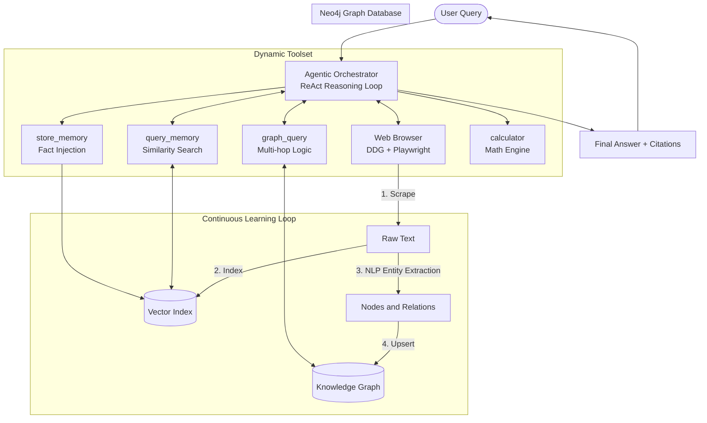

# Refined Active GraphRAG Agent 🧠🕸️

An advanced **Autonomous GraphRAG Agent** that unifies vector similarity and relational reasoning into a single **Pure Neo4j architecture**. The system intelligently decides whether to answer directly, search its long-term memory, or browse the live internet—continuously learning from every interaction.

## Key Features

*   **Pure GraphRAG:** ChromaDB has been replaced by **Neo4j**'s native vector index. Text chunks, their embeddings, and structured entities/relationships all live in a single, unified database.
*   **Autonomous Agent (ReAct):** Uses an Agentic Orchestrator that dynamically chooses from a suite of tools (`web_browser`, `query_memory`, `graph_query`, `calculator`) to answer complex queries.
*   **Continuous Learning Loop:** 
    *   **From Web:** Scraped content is automatically chunked, indexed, and enriched with extracted entities and relationships.
    *   **From Chat:** Every user query and assistant answer is automatically indexed into memory for future recall.
*   **Multi-Hop Reasoning:** Capable of traversing the knowledge graph to "connect the dots" across multiple entities and relationships.
*   **Beautiful Terminal UI:** Powered by `Rich` for a polished, interactive experience with streaming tokens and status indicators.

## Architecture



## Project Structure

```
active_rag/
├── agent.py                  # Agentic Orchestrator (Main Entry Point)
├── vector_store.py           # Neo4j-backed Vector Store (Chunk Management)
├── knowledge_graph/          # Neo4j Client & Graph Operations
├── nlp_pipeline/             # Entity & Relation Extraction
├── tools/                    # ReAct Agent Toolset (Web, Graph, Calc, etc.)
├── web_search.py             # Playwright-based Scraper
└── config.py                 # Centralized Configuration
main.py                       # CLI Interface
scripts/
└── health_check.py           # System Diagnostics
```

## Setup

### 1. Requirements
*   Python 3.10+
*   Docker (for Neo4j)
*   An LLM backend (Ollama, OpenAI, or GitHub Copilot API)

### 2. Installation
```bash
pip install -r requirements.txt
python -m spacy download en_core_web_sm
playwright install chromium
```

### 3. Start Neo4j
```bash
docker-compose -f docker-compose.neo4j.yml up -d
```

## Configuration

Settings are managed via a `.env` file:

| Variable | Default | Description |
| :--- | :--- | :--- |
| `MODEL_NAME` | `gpt-4o` | LLM model to use |
| `OLLAMA_BASE_URL` | `http://localhost:4141/v1` | API endpoint (e.g., local proxy or Ollama) |
| `NEO4J_URI` | `bolt://localhost:7687` | Neo4j Bolt connection string |
| `VECTOR_INDEX_NAME` | `active_rag` | Name of the vector index in Neo4j |
| `HEADLESS` | `true` | Set to `false` to see the browser while scraping |

## Usage

### Interactive Mode (Recommended)
```bash
python main.py
```

### Direct Query
```bash
python main.py "How is A connected to C in my family tree?"
```

### Internal Commands
*   **`/stats`**: View knowledge base size (nodes, relations, chunks).
*   **`/health`**: Run full system diagnostics.
*   **`/reset`**: Wipe the entire knowledge base and start fresh.
*   **`/dump`**: See every raw text chunk learned by the agent.
*   **`/clear`**: Clear current conversation context.

## Testing
```bash
python -m pytest tests/
```
